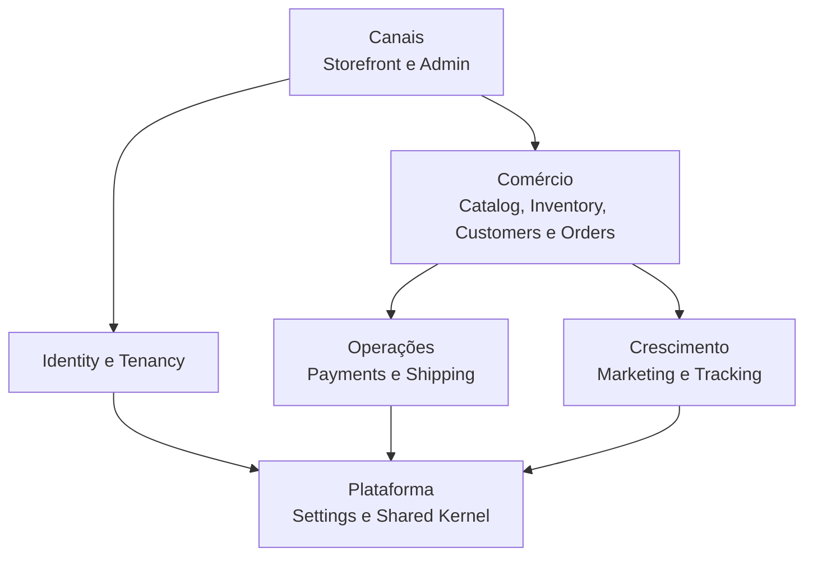

# Mapa de domínios

Este documento define propriedade e colaboração entre os módulos do HUB Commerce. Ele descreve o alvo arquitetural; o código legado será migrado de forma incremental.

## Visão geral

## Responsabilidades

| Módulo | É proprietário de | Pode consumir | Não pode assumir |
|---|---|---|---|
| Identity | usuário global, autenticação, sessões, MFA | Tenancy memberships | papel global equivalente a acesso em loja |
| Tenancy | tenant, domínio, membership, contexto e lifecycle | Identity | tenant vindo de header público |
| Catalog | produtos, categorias, variações, mídia e atributos | Tenancy, Inventory read model | estoque ou pagamento como campos livres |
| Inventory | saldo, reserva, movimentação e alertas | Catalog identifiers, Orders events | decremento sem transação |
| Customers | perfil por tenant, endereços, consentimentos, CRM | Identity, Tenancy, Orders read model | cliente global compartilhado silenciosamente |
| Orders | carrinho validado, pedido, itens e máquina de estados | Catalog, Inventory, Customers, Payments, Shipping | resposta do frontend como fonte de preço/status |
| Payments | tentativas, transações, webhooks, refunds e reconciliação | Orders, Tenancy Settings | PAN/CVV ou aprovação simulada |
| Shipping | cotação, embalagem, etiqueta, transportadora e rastreio | Orders, Catalog, Tenancy Settings | credencial global fixa |
| Storefront | experiência pública, navegação, SEO e tema | APIs públicas dos módulos | endpoint Admin |
| Marketing | campanhas, cupons promocionais e afiliados | Catalog, Customers, Orders events | métrica inventada |
| Tracking | consentimento, eventos, destinos e agregações | Storefront/Orders events, Tenancy Settings | payload arbitrário confiável |
| Settings | configuração tipada e secrets por tenant | Tenancy | devolver secrets completos |
| Shared Kernel | Money, IDs, Clock e contratos transversais mínimos | — | regra específica de domínio |

## Fluxos principais

### Publicação da loja

1. Admin autorizado altera configuração do tenant.
2. Storefront publica versão validada do layout.
3. Cache tenant-aware é invalidado.
4. Storefront lê somente contrato público sem secrets.

### Checkout

1. Storefront envia IDs, quantidades, endereço e token de pagamento.
2. Orders recalcula preços no servidor.
3. Inventory reserva estoque.
4. Payments cria tentativa idempotente.
5. Webhook assinado confirma ou rejeita.
6. Orders transiciona estado.
7. Inventory confirma ou libera reserva.
8. Tracking recebe evento confiável de domínio.

### Operação administrativa

1. Identity autentica.
2. Tenancy resolve membership e tenant ativo.
3. Policy autoriza ação/recurso.
4. Módulo executa caso de uso.
5. Auditoria registra ator, tenant, alvo e resultado sem secrets/PII excessiva.

## Dados landlord e tenant-owned

Landlord candidatos: tenants, tenant_domains, usuários globais e catálogo de planos.

Todo o restante é tenant-owned por padrão. Exceções exigem ADR. A classificação final e a estratégia de banco serão aprovadas na Fase 3.
